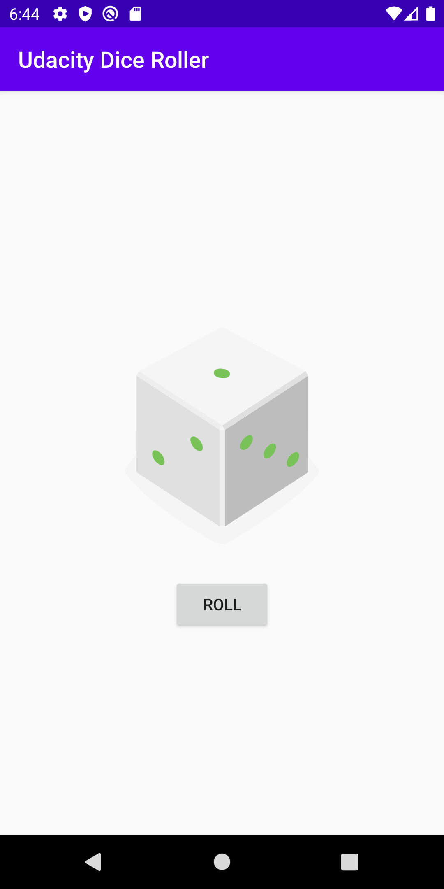
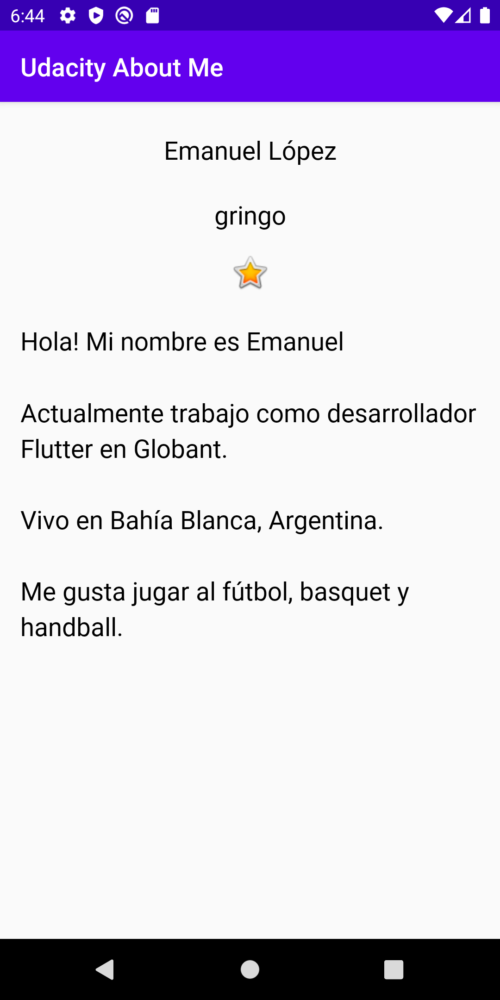
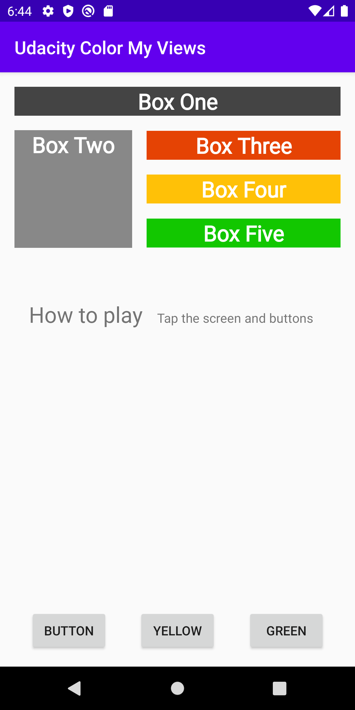
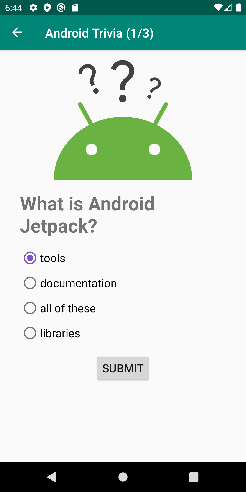
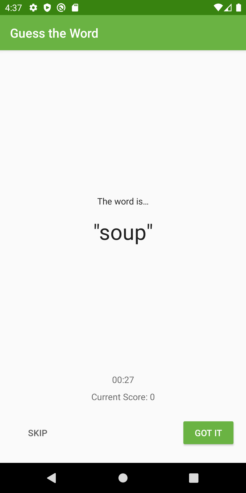

# android-kotlin-udacity-ud9012
Apps developed during the Android [App Development in Kotlin](https://www.udacity.com/course/developing-android-apps-with-kotlin--ud9012) course on Udacity

Dice roller | About me
--- | ---
 | 

Color my views | Trivia app
--- | ---
 | 

Dessert pusher | Guess it
--- | ---
 | 